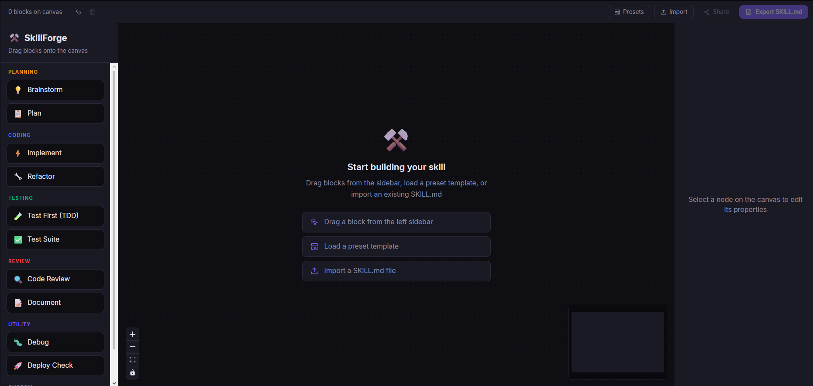

<p align="center">
  
</p>

<h1 align="center">SkillForge</h1>

<p align="center">
  Visual drag-and-drop builder for composable AI agent skills
</p>

<p align="center">
  <a href="#features">Features</a> •
  <a href="#quick-start">Quick Start</a> •
  <a href="#usage">Usage</a> •
  <a href="#contributing">Contributing</a> •
  <a href="#community-skills">Community Skills</a> •
  <a href="#roadmap">Roadmap</a>
</p>

<p align="center">
  <a href="https://github.com/user/skillforge/actions"></a>
  <a href="https://github.com/user/skillforge/blob/main/LICENSE"></a>
  <a href="https://github.com/user/skillforge/stargazers"></a>
  <a href="https://github.com/user/skillforge/issues"></a>
  <a href="https://github.com/user/skillforge/pulls"></a>
</p>

<p align="center">
  
</p>

---

## Why SkillForge?

The AI agent skills ecosystem is exploding — 280k+ published skills and growing. But creating skills today means writing YAML and Markdown files by hand.

SkillForge gives you a visual canvas where you drag skill blocks, wire them into workflows, edit instructions inline, and export a valid `SKILL.md` in one click. Works with **Claude Code**, **Kiro**, **GitHub Copilot**, **Cursor**, and any agent that reads the open skill format.

## Features

- 🖱️ **Drag & drop** — 11 predefined blocks across 6 categories
- 🔗 **Wire workflows** — connect blocks to define execution order
- ✏️ **Inline editing** — label, description, and Markdown instructions per node
- 📄 **One-click export** — generates valid `SKILL.md` with YAML frontmatter
- 📋 **Copy or download** — clipboard or file, your choice
- 🌙 **Dark theme** — easy on the eyes, built for long sessions
- 🐳 **Dockerized** — one command to run

## Quick Start

### Docker (recommended)

```bash
git clone https://github.com/user/skillforge.git
cd skillforge
docker compose up --build
```

Open [http://localhost:5173](http://localhost:5173)

### Local

```bash
git clone https://github.com/user/skillforge.git
cd skillforge
npm install
npm run dev
```

## Usage

1. **Drag** a block from the sidebar onto the canvas
2. **Connect** blocks by dragging from a bottom handle to a top handle
3. **Click** a block to edit its label, description, and instructions
4. **Export** — hit the button in the top bar to preview, copy, or download your `SKILL.md`


### Example output

```yaml
---
name: "tdd-workflow"
description: "Use when the user asks to build a feature using test-driven development"
---

## Step 1: 💡 Brainstorm

> Generate and explore ideas before committing to a plan

- Gather requirements from the user
- List at least 3 possible approaches
- Recommend the best path forward

## Step 2: 🧪 Test First (TDD)

> Write tests before implementation code

- Write a failing test for the next requirement
- Implement the minimum code to make it pass
- Refactor while keeping tests green

## Step 3: ⚡ Implement

> Write production code following best practices

- Follow the established plan step by step
- Write clean, idiomatic code

## Step 4: 🔍 Code Review

> Review code for quality, security, and correctness

- Check for security vulnerabilities
- Verify error handling is comprehensive
```

## Community Skills

Have a great skill workflow? We'd love to feature it.

Drop your exported `SKILL.md` files in the [`community-skills/`](community-skills/) directory and open a PR. See [CONTRIBUTING.md](CONTRIBUTING.md) for details.

## Roadmap

- [ ] Community skill gallery with search and one-click import
- [ ] Shareable workflow links (URL-encoded state)
- [ ] Import existing `SKILL.md` files back onto the canvas
- [ ] Skill templates marketplace
- [ ] Multi-agent orchestration view (subagent chains)
- [ ] VS Code / Kiro extension for in-editor skill building
- [ ] Collaborative editing (multiplayer canvas)

## Tech Stack

| Layer | Tech |
|-------|------|
| UI | React 19, TypeScript |
| Canvas | React Flow (@xyflow/react) |
| State | Zustand |
| Styling | Tailwind CSS |
| Icons | Lucide React |
| Build | Vite |
| Container | Docker |

## Contributing

Contributions are welcome. Please read [CONTRIBUTING.md](CONTRIBUTING.md) before opening a PR.

## License

[MIT](LICENSE) — use it, fork it, build on it.

---

<p align="center">
  Built with ⚒️ by the community
</p>
